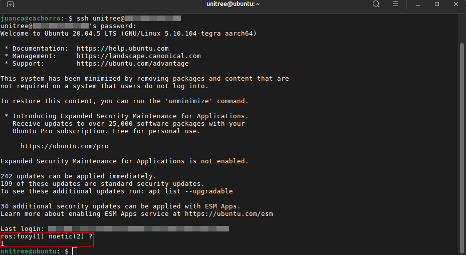

.. _humble_robot_build:

Build into the robot
######################

.. note::
    For this guide we will assume that you have an SSH connection to the robot and that it also has an internet connection.

Connect to the robot
********************

First we will establish a connection with the robot via ssh

.. code-block:: bash

    ssh unitree@<robot-ip>

Afterwards, you'll see that a connection has been established, and at startup, you'll have to choose which version of ROS you're going to use. Click option 1, choosing ROS 2 Foxy.

.. raw:: html

     

Build Go2 Robot packages
************************
First we are going to prepare our workspace where we are going to add the necessary packages

.. code-block:: bash

   cd ~/cyclonedds_ws/src
   wget -qO- https://raw.githubusercontent.com/Unitree-Go2-Robot/go2_robot/refs/heads/humble/dependencies.repos | vcs import .

.. note::
    The cyclonedds_ws workspace should already be created on your robot. If not, please create it with ``mkdir -p ~/cyclonedds_ws/src``

Installs all the necessary dependencies to build the packages

.. code-block:: bash

   cd ~/cyclonedds_ws
   sudo rosdep init
   rosdep update
   rosdep install --from-paths src --ignore-src -r -y

Finally, build the packages

.. code-block:: bash

   colcon build --symlink-install
   source ~/cyclonedds_ws/install/setup.bash
